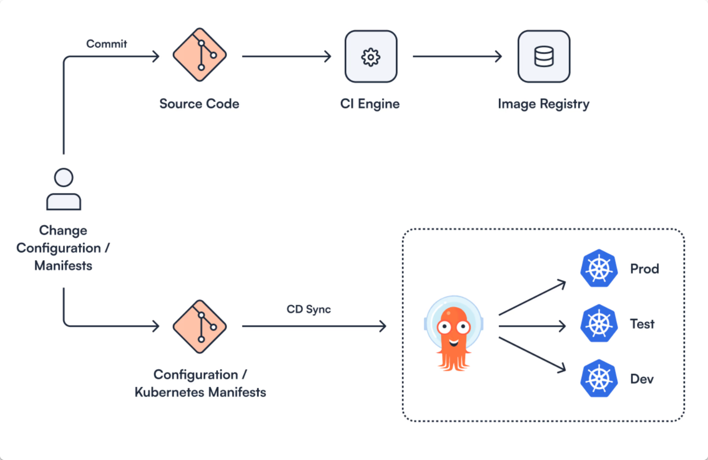
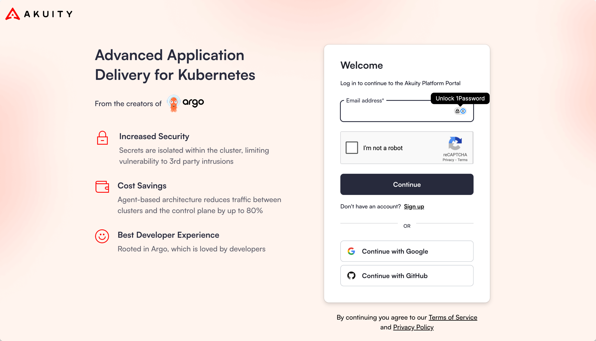

# Workshop Prerequisites<!-- MODIFY THIS HEADING IF APPLICABLE -->

## Getting Started <!-- MODIFY THIS SUBHEADING -->
To best understand this tutorial, make sure you have at least minimal working knowledge of **GitOps, Argo CD, Kargo, and KubeVision**. Luckily, we have a few guides here:
<ul>
<li><a href="https://akuity.io/gitops">GitOps</a></li>
<li><a href="https://akuity.io/blog/deployment-made-easy-with-argo-cd">Argo CD</a></li>
<li><a href="https://akuity.io/blog/promotion-made-easy-with-kargo">Kargo</a></li>
<li><a href="https://akuity.io/blog/cluster-monitoring-made-easy-with-kubevision-kubevision-for-beginners">KubeVision</a></li>
</ul>

## To Start This Workshop, You'll Need: 
<ol>
    <li>A <a href="https://github.com/">GitHub account</a></li>
    <li>A <a href="https://docs.github.com/en/authentication/keeping-your-account-and-data-secure/managing-your-personal-access-tokens">GitHub PAT</a></li>
    <li>An <a href="https://akuity.cloud">Akuity account</a> (A 30 Day Free Trial is Available)</li>
    <li>An <a href="https://aws.amazon.com/free/?all-free-tier.sort-by=item.additionalFields.SortRank&all-free-tier.sort-order=asc&awsf.Free%20Tier%20Types=*all&awsf.Free%20Tier%20Categories=*all">AWS account</a></li>
    <li>An <a href="https://docs.aws.amazon.com/eks/latest/userguide/getting-started.html">EKS Cluster</a> ready
</ol>

{}
You can skip this step if you already have these tools installed/configured.
{}