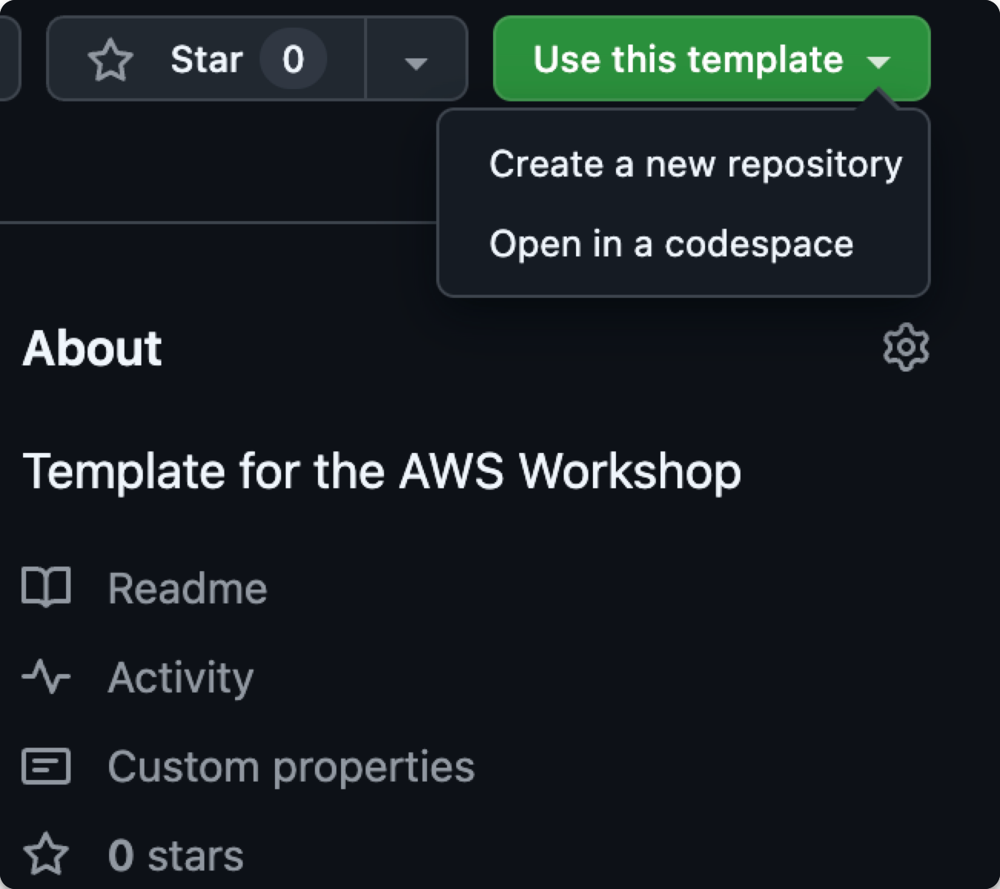

# Setting Up Your Environment
A template is provided for this workshop. You have the option of using this template in **Codespaces**.

To use the <b>template</b>:

1. Click this [link](https://github.com/akuity/eks-workshop-template) to clone the repository to your GitHub.
Ensure the desired "Owner" is selected (e.g., your account and not an organization).
 
2. Enter ``akuity-eks-workshop`` for the repository name.
 
3. Click ``Create repository from template``.
 
4. *(Optional)* You can start a Codespace by clicking the green code button on the repo page, selecting the Codespaces tab, and then selecting ``Create codespace on main.``  
The codespace will open in another browser tab with information about setting up your Codespace. Once it's done setting up, you should see a terminal in the browser with the repo open.

{}
Unfamiliar with Codespaces? Check out the official documentation [here.](https://docs.github.com/en/codespaces/overview)
{}