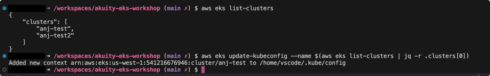

## Authenticate AWS CLI
{}
You can skip this step if you're already authenticated.
{}
1. In your terminal, enter this command: <br>
```aws configure```
<br>
2. You will be prompted to add your **AWS Access Key ID** and **AWS Secret Access Key**.
<br>
3. Set your default region. (e.g., us-west-1)
<br>
4. You can verify if you're authenticated by using this command in the terminal:<br>
```aws sts get-caller-identity```
<br>

## Set Up kubectl Access to EKS
Make sure you have ```aws``` and ```kubectl``` CLIs installed. If you're using a **Codespace** this should already be done for you. You'll need to configure the ```kubectl``` context to access your EKS cluster.

1. You can view your clusters in the terminal. <br>
Use the command: ```aws eks list-clusters```<br>

    The output should be similar to the following:
    
    ```shell {
    "clusters": [
        "eksworkshop-eksctl"
        ]
    }
    ```
2. Create a [kubeconfig file for your cluster](https://docs.aws.amazon.com/eks/latest/userguide/create-kubeconfig.html) using the following command:<br>

```aws eks update-kubeconfig --name $(aws eks list-clusters | jq -r .clusters[0])```
<br>

The output should be similar to the following:<br>
```shell
 Added new context arn:aws:eks:us-east-1:338615488317:cluster/<cluster-name> to /home/vscode/.kube/config
 ```
<br>



<br>

{}
Let's break down that command, shall we? <br>
This part of the command: ```aws eks list-clusters``` lists all EKS clusters in the current AWS account and region. <br>
This part of the command: ```$(aws eks list-clusters | jq -r .clusters[0])``` is a sub-command, which means it will be executed first, and its output will be used as the value for ```--name``` parameter. <br>
The ```|``` pipe symbol takes the output of the previous command (the list of clusters) and passes it as input to the next command.<br>
Lastly, ```jq -r .clusters[0]```jq is a command line tool for processing JSON. The ```-r``` option tells ```jq``` to output raw text instead of JSON-formatted text. <br>
```.clusters[0]``` extracts the first element of the clusters array from the JSON output provided by the aforementioned ```aws eks list-clusters```.
{}<br>

1. Let's test to see if ```kubectl``` can access the cluster.<br>
```k get nodes```
<br>

The output should be similar to the following:

```shell
NAME                              STATUS   ROLES    AGE   VERSION
ip-192-168-108-33.ec2.internal    Ready    <none>   2d    v1.28.8-eks-ae9a62a
ip-192-168-158-117.ec2.internal   Ready    <none>   2d    v1.28.8-eks-ae9a62a
ip-192-168-182-251.ec2.internal   Ready    <none>   2d    v1.28.8-eks-ae9a62a
```

Now you're ready to set up your Argo CD Instance.