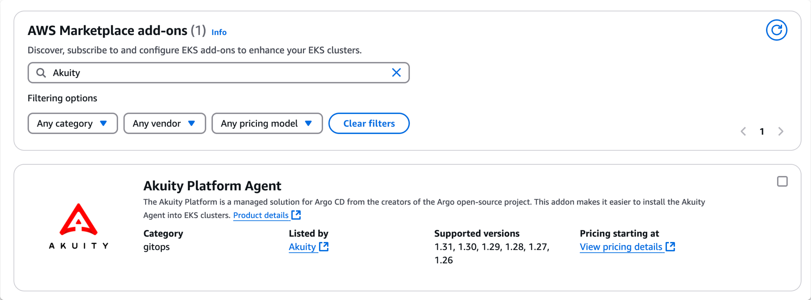
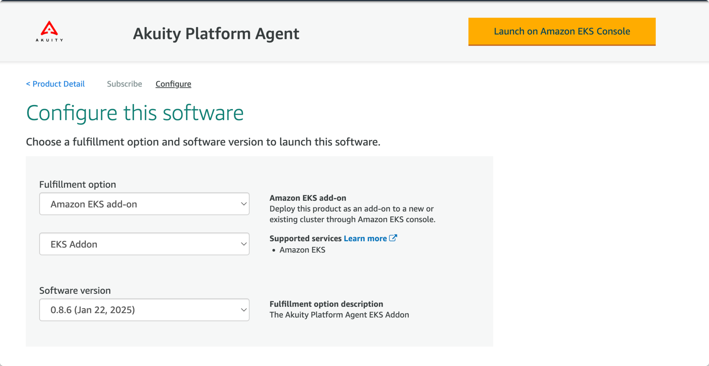

# Setting Up the Akuity Platform Agent

## Create the Akuity Namespace
Copy this code snippet and paste to your terminal: <br> ```kubectl create namespace akuity```
This command creates the Akuity namespace.

## Adding Your Cluster in the AWS Console

1. Go to the EKS cluster in the AWS Console.

2. Go to the add-on tab and select *Get More Add-Ons*. Scroll down until you get to **AWS Marketplace add-ons**.

3. Find and select [*Akuity Platform Agent*](https://aws.amazon.com/marketplace/pp/prodview-zihrsklxqjuu6?sr=0-1&ref_=beagle&applicationId=AWSMPContessa).

4. After clicking **Continue to Configuration**, you'll see a page like this:

Make sure you configure the fulfillment option as an **Amazon EKS add-on**. Set the software version to the latest version.

4. On Akuity Platform's cluster page, add the "Configuration Values" box under "Optional Configuration Settings."

5. Finish filling out the wizard and hit "Create." <br>

To verify that the installation was successful, use the AWS Management Console to confirm that the **akuity_agent add on** is **Creating**. 

6. The add-on needs the secret and once it is applied, it will continue installing and then become **Active**. You will find the kubernetes secret to the cluster in a large box on the AKP's cluster page. It starts with <code>export TOKEN=</code>

