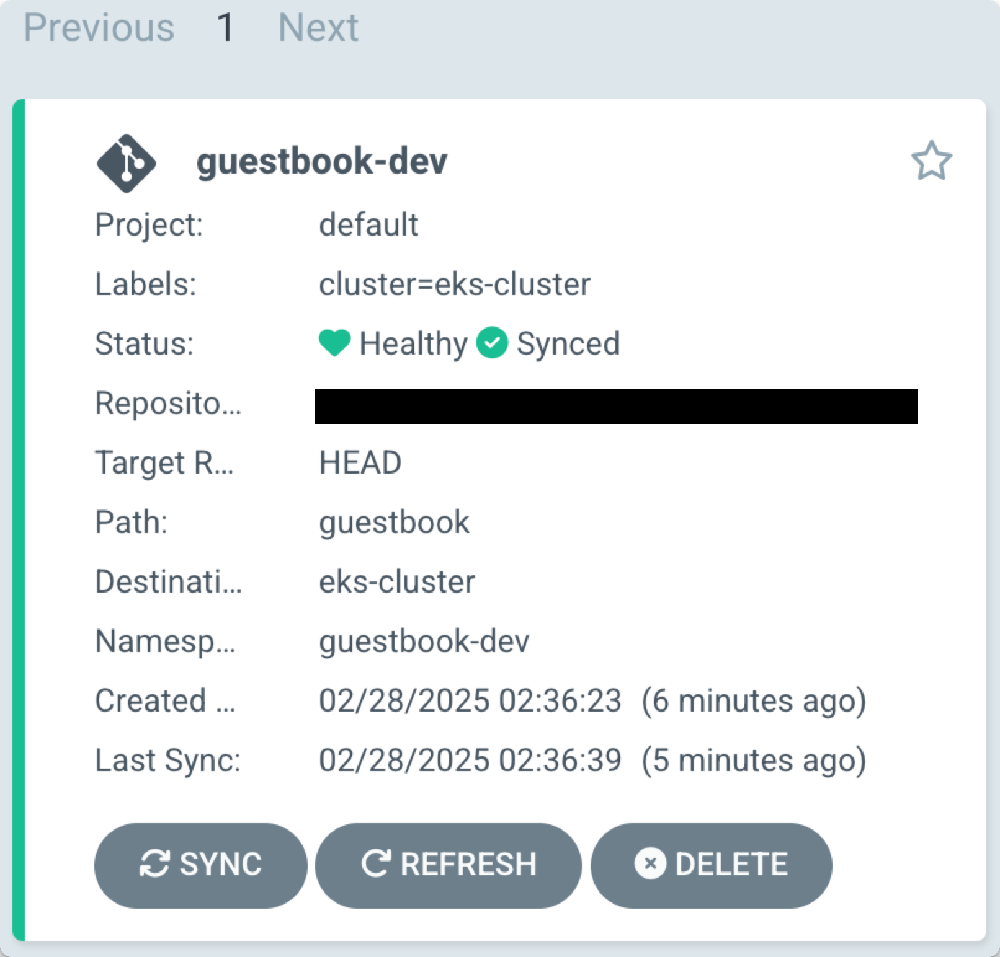
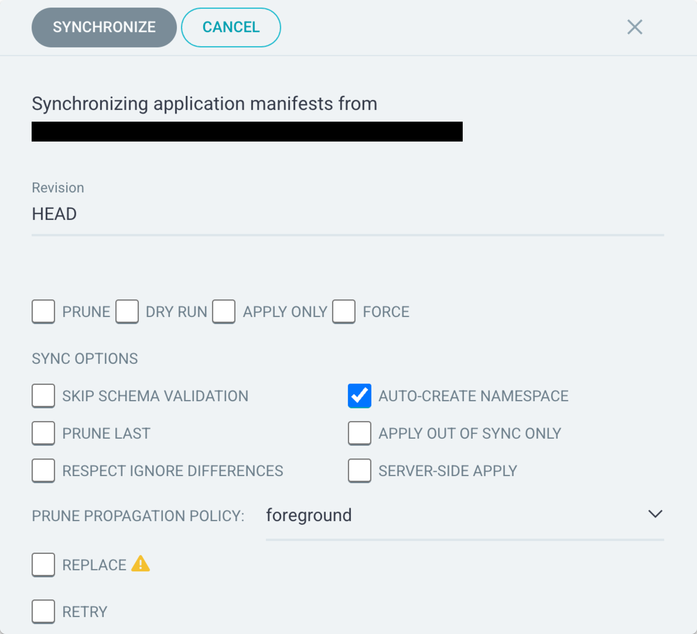
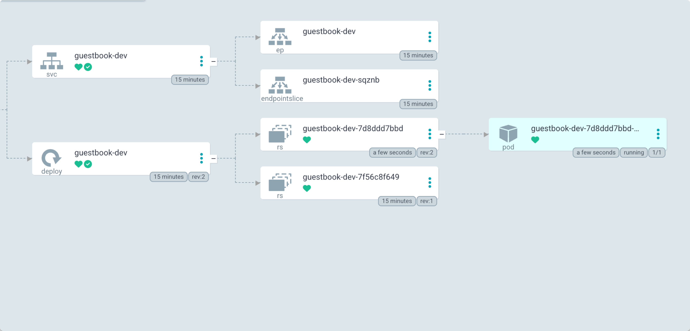

# Deploying Helm Charts with Argo CD
We have a sample helm chart in the template. Let's deploy with Argo CD.
<br>

## Create an Application in Argo CD
1. Navigate to Argo CD UI using the instance URL.
<br>

2. Click **+ NEW APP**
<br>

3. Select **EDIT AS YAML**
<br>

4. Paste this from the template in ```apps/guestbook-dev.yaml```:<br>
   
```yaml

apiVersion: argoproj.io/v1alpha1
kind: Application
metadata:
  name: guestbook-dev
  namespace: argocd
spec:
  project: default
  source:
    repoURL: 'https://github.com/<github-username>/<repo-name>'
    path: guestbook
    targetRevision: HEAD
    helm:
      valueFiles:
        - values-dev.yaml
  destination:
    namespace: guestbook-dev
    name: <cluster-name>
  syncPolicy:
    syncOptions:
      - CreateNamespace=true
```
<br>

5. Edit the necessary information into this template if needed (repository name, username, cluster name)
<br>

6. Once everything looks good, click **SAVE**. The UI will then translate the Application manifest into the corresponding fields in the wizard.
<br>


7. Finally, click **CREATE**.The new app pane will close and show the card for the Application you created. 
<br>



<br>

{}
The status on the card will show **Missing** and **OutOfSync**, but don't worry, this is intended.
{}

## Time to Sync!

1. Click on your Application Card titled ```argocd/guestbook-dev```.
<br>


2. Click **SYNC** then **SYNCHRONIZE** to instruct Argo CD to create the resources defined by the Application.
<br>



<br>


The resource tree will expand as the Deployment creates a ``replicaSet`` that makes a pod, and the Service creates an ``Endpoint`` and ``EndpointSlice``. The Application will remain in the "Progressing" state until the pod for the deployment is running.

Afterwards, all the top-level resources (i.e., those rendered from the Application source) in the tree will show a green checkmark, indicating that they are **synced** (i.e., present in the cluster).

## Syncing Changes Manually
An Application now manages the deployment of the guestbook Helm chart. So what happens when you want to deploy a new image tag?

1. Navigate to ```guestbook/values-dev.yaml``` in your repository.
  <br>

2. Go ahead and edit the ```image.tag``` value.
<br>
```yaml
image:
    tag: 0.2.0
```
<br>
3. Commit these changes, add a commit message.
<br>
4. Go back to the Argo CD UI, and go back to your ```argocd/guestbook-dev``` Application. <br>
  
5.Click **REFRESH** to trigger Argo CD to check for any changes to the Application source.
<br>

6.Click **SYNC** then **SYNCHRONIZE** to instruct Argo CD to deploy the changes.
<br>

Due to the change in the repo, Argo CD will detect that the Application is out-of-sync. It will template the Helm chart (i.e., ```helm template```) and patch the ```guestbook-dev``` deployment with the new image tag, triggering a rolling update.
<br>



## Enable Auto-Sync and Self-Healing for the Guestbook
Now that you are using an Application to describe how to deploy the Helm chart into the cluster, you can configure the sync policy to automatically apply changes — removing the need for developers to manually trigger a deployment for changes that already made it through the approval processes.

1. On the top menu, click **DETAILS**.

2. Under the **SYNC POLICY** section, click **ENABLE AUTO-SYNC** and on the prompt click OK.

3. Below that, on the right of **SELF HEAL**, click **ENABLE**.

If the Application was out-of-sync, this would immediately trigger a sync. In this case, your Application is already in sync, so Argo CD made no changes.

## Demonstrate Application Auto-sync via Git
With auto-sync enabled on the ```guestbook-dev``` Application, changes made to the ```main``` branch in the repo will be applied automatically to the cluster. You will demonstrate this by updating the number of replicas for the ```guestbook-dev``` deployment.

1. Navigate to your repo, and open the file ```guestbook/values.yaml```.

2. Update the ```replicaCount``` to 2.

3. Commit your changes.

4. Switch to the Argo CD UI and go back to the ```argocd/guestbook-dev``` Application.


5. In the top right, click the **REFRESH** button to trigger Argo CD to check for any changes to the Application source and resources.
<br>


You can view the details of the sync operation by, in the top menu, clicking SYNC STATUS. Here it will display, what **REVISION** it was for, what triggered it (i.e., "INITIATED BY: automated sync policy"), and the result of the sync (i.e., what resources changed).
<br>

Let's try doing the same thing, adding a ```replicaSet``` with **Kargo**! :arrow_right: