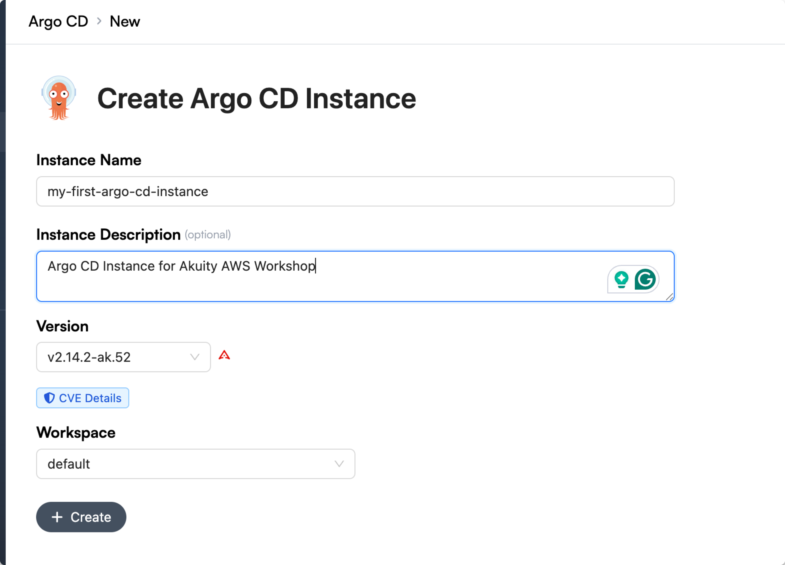
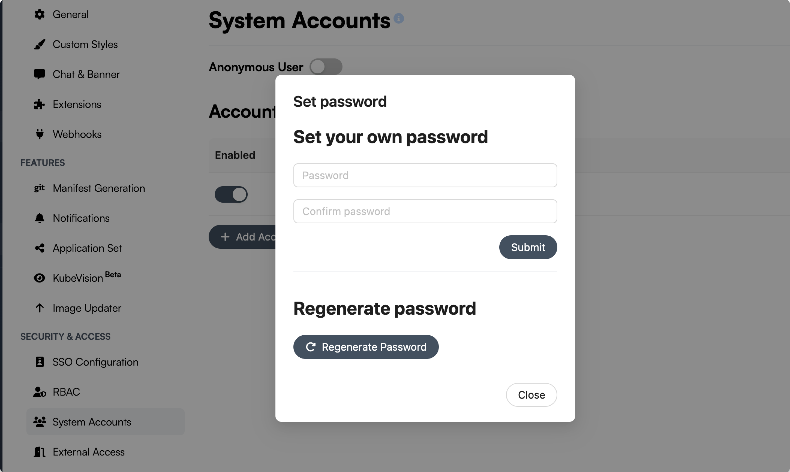
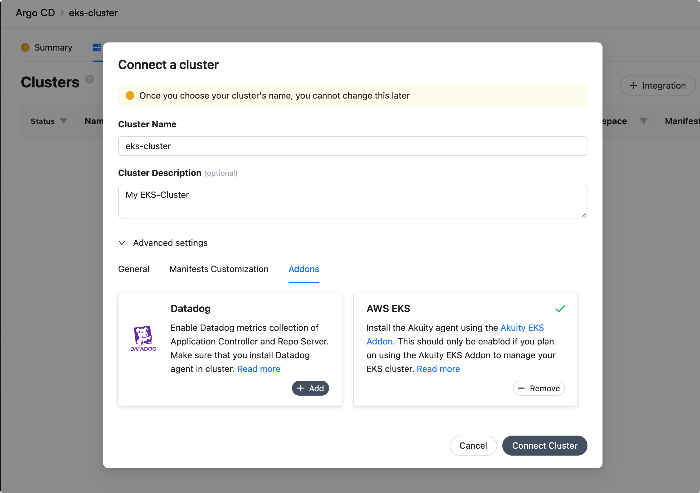

Now that our Akuity Add-On is configured, we can move over to the Akuity Platform to set up your instance and connect our EKS add-on.

## Create an Argo CD Instance
1. Navigate to **Argo CD**
<br>
2. Click **+ Create** in the upper right hand corner of the dashboard.
<br>
3. Name your instance.
<br>
4. *(Optional)* Add a description.



<br>

5. Click **+ Create** when you're satisfied with the name.

<br>
Once you click create, your Argo CD instance will begin initializing. This takes a few minutes. You'll know it's done when the cogwheel next to your instance name stops turning, and the status becomes :green_heart: healthy.

## Configure Your Argo CD Admin Account
Now that you have your instance set up, you'll need to set up your admin account.
1. In the dashboard for the Argo CD Instance, click **Settings**.
<br>

2. On the sidebar on the right, under **Security & Access**, and then click **System Accounts**.
<br>

3. Enable **Admin Account** by clicking the toggle and clicking confirm when prompted.
<br>

4. Go ahead and set your admin password by clicking **Set Password**. Once a password is set, Argo CD will need to reinitialize, so wait until the cogwheel is done turning.
<br>

<br>

{}
Put a pin in this!: keep your password handy, we'll need it to access the Argo UI.
{}

5. To access your Argo CD Instance, click the instance URL in the **Summary** tab. Your URL may look like this:<br>
```123456letters.cd.akuity.cloud```
<br>

6. You'll be brought to the Argo CD login. **admin** is your user, and use the password you set in step 4.
<br>


<br>

## Configure Your Cluster
1. On your Argo CD Instance, click **Clusters**.
<br>

2. Click **Connect a Cluster**.
<br>

3. For the sake of this workshop, set your cluster's name to ```eks-cluster```.
<br>

4. *(Optional)* Add a description. You can put your EKS cluster's name in this field.
<br>

5. Click **Advanced Settings**
<br>

6. On the Add-Ons tab, you'll see two options: **Datadog**, and **AWS EKS**.
<br>

7. Make sure you click **+Add** on AWS EKS.
<br>



<br>

8. Go ahead and click **Connect Cluster** once you're done.
<br>

9. You'll be prompted to either use the AWS Console or AWS CLI to install the agent to your cluster. Follow the directions on whichever one you prefer.
<br>

10.  Check that your target is the correct cluster by running this command:<br>
```kubectl config current-context ```
<br>

The output should look something like this:
```shell
arn:aws:eks:us-east-1:338615488317:cluster/cluster-name
```
<br>
11. You can check the pods in the <code>akuity</code> namespace by using the command: <code>kubectl get pods -n akuity</code>

<br>

The output should look something like this:
```shell
NAME                                                       
akuity-agent-<replicaset-id>-<pod-id>                       1/1     Running   0          65s
akuity-agent-<replicaset-id>-<pod-id>                       1/1     Running   0          65s
argocd-application-controller-<replicaset-id>-<pod-id>      2/2     Running   0          65s
argocd-notifications-controller-<replicaset-id>-<pod-id>    1/1     Running   0          65s
argocd-redis-<replicaset-id>-<pod-id>                       1/1     Running   0          65s
argocd-repo-server-<replicaset-id>-<pod-id>                 1/1     Running   0          64s
argocd-repo-server-<replicaset-id>-<pod-id>                 1/1     Running   0          64s

```

Once you see a :green_heart: green heart before the cluster name on your Argo CD instance, it signifies that your cluster health is **Healthy**.<br>
Now your cluster is set up on the Akuity Platform. Your cluster data is uploaded to the platform so we have don't have to do this for Kargo and KubeVision.