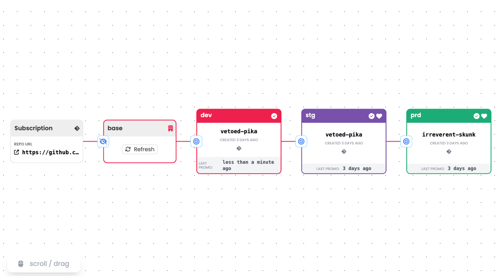

# Hop on Kargo!
Let's take a brief tour of Kargo on the Akuity Platform using the Argo CD instance we set up in the previous module. <br>
Through this exercise, users will learn how to promote with Kargo by updating ```replicaCount```. 

