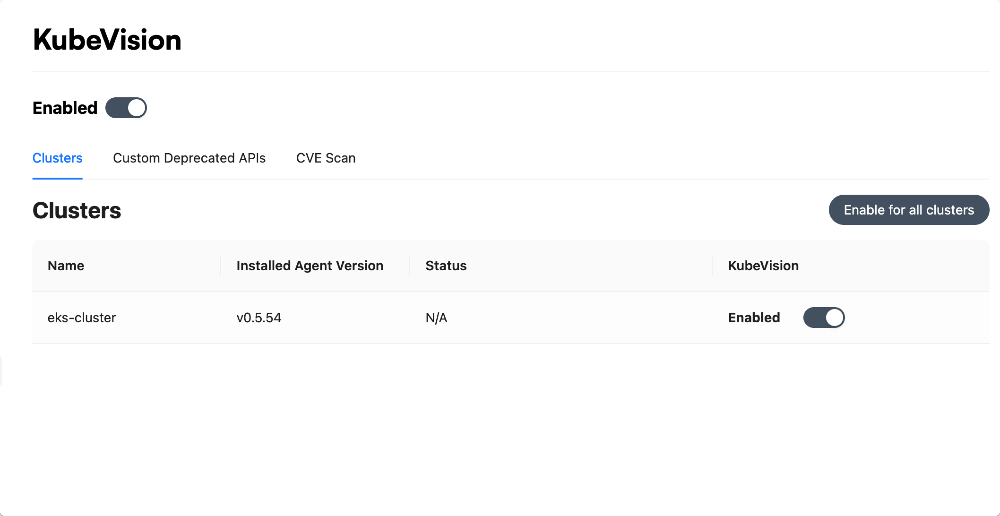

## Turn on KubeVision

1. Go to your Argo CD instance and click on Settings in the top right corner.
 

1. Search for KubeVision on the Feature tab on the left.
 

2. Enable the KubeVision feature for your Argo CD instance.
 

3. Once enabled, it'll list all the clusters configured in your Argo CD Instance. Enable the KubeVision feature for your desired cluster.
 

